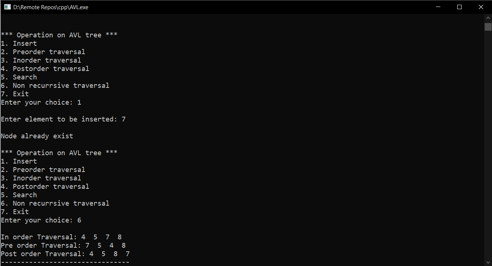

# AVL Tree
AVL tree is a self-balancing Binary Search Tree (BST) where the difference between heights of left and right subtrees cannot be more than one for all nodes. 
This programs include following operations on AVL Tree :
## Insert
1. Check if tree is empty or not
2. If value is less than root value
3. If value is greater than root value
4. If value is already present in tree
## Search
Search is implemented using recurssion. If the serach value is equal to root node it will return the node value. If not it will search further in left and right. If the value is not found it will return value not found.
## Traversal (With and Without Recursion)
For the non recursive functions stack is used. 

- Inorder
- Preorder
- Postorder

## Output

